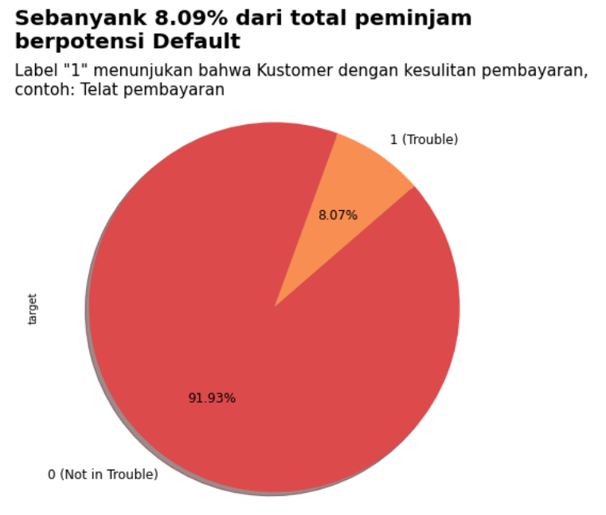

# Project: Credit Scoring dengan Machine Learning  
**Peran:** Data Scientist Intern  
**Perusahaan:** Home Credit Indonesia  
**Metode Analisis:** Machine Learning (Logistic Regression)

## Latar Belakang Proyek  
Home Credit menggunakan metode statistik dan Machine Learning untuk membangun **prediksi skor kredit**. Tujuannya adalah:
- Memastikan pelanggan yang layak tidak ditolak saat mengajukan pinjaman
- Menyediakan pinjaman dengan struktur **principal**, **maturity**, dan **repayment calendar** yang memotivasi pelanggan untuk sukses

## Tujuan  
Mengembangkan model Machine Learning **end-to-end** untuk memprediksi kelayakan kredit pelanggan, sehingga dapat meminimalkan risiko dan meningkatkan persetujuan pinjaman yang sehat.

## Langkah Pengerjaan  
1. **Exploratory Data Analysis (EDA)**  

| Distribusi Peminjaman YoY | Distribusi Pengajuan Kredit YoY | Potensi Default |
|-----|-----|-----|
|  |  |  |

| %Kreditur berdasarkan Region Age Group | %Kreditur berdasarkan Gender | %Kreditur berdasarkan Region Rating |
|-----|-----|-----|
|  |  |  |

| %Kreditur berdasarkan Income | %Kreditur berdasarkan Penggantian No HP | %Kreditur berdasarkan House Type |
|-----|-----|-----|
|  |  |  |

| %Kreditur berdasarkan Education | %Kreditur berdasarkan Job Category |
|-----|-----|
|  |  |

2. **Pemodelan Machine Learning**  

| Logistics Regreresion | Logistics Regreresion with Hyperparameter tuning |
|-----|-----|
|  |  |

Kedua model memiliki performa yang mirip dengan akurasi dan AUC yang sama. Hyperparameter tuning hanya memberikan sedikit perubahan pada precision dan recall, namun tidak meningkatkan kinerja secara keseluruhan.

3. **Evaluasi Model**  

| Evaluasi Model | Hasil |
|-----|-----|
|  | AUC = 0.7303 menunjukkan model memiliki kemampuan diskriminasi yang cukup baik untuk membedakan antara pelanggan yang “baik” (mampu membayar) dan “buruk” (gagal bayar). Kurva ROC berada cukup jauh di atas garis diagonal (random guess), menandakan model bekerja lebih baik dibanding tebakan acak. |
|  | KS Score = 0.3379 (33.79%) mengindikasikan ada perbedaan distribusi probabilitas prediksi yang cukup jelas antara kelas “baik” dan “buruk”. Semakin tinggi nilai KS (maksimum 1), semakin baik pemisahan antara kedua kelas. Nilai di atas 0.3 umumnya dianggap memadai dalam credit scoring. |

## Hasil  
| Model | Hasil |
|-----|-----|
|  | Fitur dengan pengaruh positif terbesar terhadap kemungkinan default: `region_rating_client_w_city`, `days_last_phone_change`, `days_id_publish`. Fitur dengan pengaruh negatif terbesar (mengurangi risiko default): `ext_source_3` → pengaruh paling kuat mengurangi risiko gagal bayar, `ext_source_2`, `ext_source_1`. Secara umum, fitur ext_source memiliki kontribusi signifikan dalam menurunkan probabilitas risiko gagal bayar, menunjukkan skor eksternal ini relevan untuk penilaian kredit. |
|  | Setelah penerapan model Logistic Regression, persentase nasabah yang diprediksi berisiko default (Trouble) adalah **11,52%**, sedangkan yang diprediksi aman (Not in Trouble) adalah 88,48%. Hal ini menunjukkan bahwa model dapat membantu mengurangi potensi gagal bayar sebesar ±11,68% dengan melakukan seleksi kredit yang lebih akurat. |

## Rekomendasi Bisnis  
- Memprioritaskan faktor-faktor risiko utama pada penilaian kredit
- Mengoptimalkan penawaran pinjaman bagi segmen pelanggan yang berpotensi tinggi untuk melunasi tepat waktu
- Menyesuaikan kebijakan pinjaman untuk meminimalkan penolakan terhadap pelanggan layak

---
**Kesimpulan:**  
Melalui pemodelan Machine Learning end-to-end, proyek ini menghasilkan sistem prediksi yang dapat membantu Home Credit meningkatkan akurasi penilaian kredit, mengurangi risiko, dan memperbesar peluang keberhasilan pinjaman.
